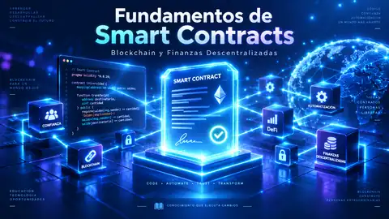

<div align="center">

<a href="https://sgevatschnaider.github.io/blockchain-finanzas-descentralizadas/unidades/u01-fundamentos-smart-contracts/">

</a>

<br>

# Unidad 1 · Blockchain y smart contracts en los negocios

**Blockchain y Finanzas Descentralizadas · Universidad de Belgrano**

Material completo · experimentación guiada · aplicaciones sectoriales · evaluación

<br>

<a href="https://sgevatschnaider.github.io/blockchain-finanzas-descentralizadas/unidades/u01-fundamentos-smart-contracts/"></a>
<a href="https://sgevatschnaider.github.io/blockchain-finanzas-descentralizadas/unidades/u01-fundamentos-smart-contracts/visor.html"></a>
<a href="https://sgevatschnaider.github.io/blockchain-finanzas-descentralizadas/unidades/u01-fundamentos-smart-contracts/laboratorios-guia.html"></a>
<a href="https://docs.google.com/presentation/d/1A-dU3SMIGzEwbqd4XOF1gJQWI-TCETFGH7MXe679XyM/edit?usp=drivesdk"></a>

</div>

---

## Acceso directo

> **No hace falta navegar por las carpetas del repositorio.** Los botones llevan directamente a cada recurso de la Unidad 1.

<table>
<tr>
<td width="50%" align="center" valign="top">
<a href="https://sgevatschnaider.github.io/blockchain-finanzas-descentralizadas/unidades/u01-fundamentos-smart-contracts/">

</a>
<br><sub>Entrada principal: teoría, materiales, laboratorios, casos, glosario y evaluación.</sub>
</td>
<td width="50%" align="center" valign="top">
<a href="https://sgevatschnaider.github.io/blockchain-finanzas-descentralizadas/unidades/u01-fundamentos-smart-contracts/visor.html">

</a>
<br><sub>18 páginas, miniaturas, capítulos, zoom, reproducción, PDF y Google Slides.</sub>
</td>
</tr>
<tr>
<td width="50%" align="center" valign="top">
<a href="https://sgevatschnaider.github.io/blockchain-finanzas-descentralizadas/unidades/u01-fundamentos-smart-contracts/laboratorios-guia.html">

</a>
<br><sub>Predicción, experimento, falla, explicación y transferencia en tres rutas.</sub>
</td>
<td width="50%" align="center" valign="top">
<a href="https://docs.google.com/presentation/d/1A-dU3SMIGzEwbqd4XOF1gJQWI-TCETFGH7MXe679XyM/edit?usp=drivesdk">

</a>
<br><sub>Presentación de la cátedra para clase, exposición o estudio secuencial.</sub>
</td>
</tr>
</table>

### Más recursos

<div align="center">

<a href="https://sgevatschnaider.github.io/blockchain-finanzas-descentralizadas/unidades/u01-fundamentos-smart-contracts/materiales/unidad-1-desarrollo-completo.pdf"></a>
<a href="https://sgevatschnaider.github.io/blockchain-finanzas-descentralizadas/unidades/u01-fundamentos-smart-contracts/desarrollo.html"></a>
<a href="https://sgevatschnaider.github.io/blockchain-finanzas-descentralizadas/unidades/u01-fundamentos-smart-contracts/guia-estudio.html"></a>
<a href="https://sgevatschnaider.github.io/blockchain-finanzas-descentralizadas/unidades/u01-fundamentos-smart-contracts/comparador.html"></a>
<a href="https://sgevatschnaider.github.io/blockchain-finanzas-descentralizadas/unidades/u01-fundamentos-smart-contracts/casos.html"></a>
<a href="https://sgevatschnaider.github.io/blockchain-finanzas-descentralizadas/unidades/u01-fundamentos-smart-contracts/glosario.html"></a>
<a href="https://sgevatschnaider.github.io/blockchain-finanzas-descentralizadas/unidades/u01-fundamentos-smart-contracts/evaluacion.html"></a>

</div>

### Accesos de respaldo

Si un navegador bloqueara imágenes externas, estos enlaces llevan a los mismos recursos:

- **Portal principal:** [`index.html`](index.html)
- **Visor del material:** [`visor.html`](visor.html)
- **PDF completo:** [`materiales/unidad-1-desarrollo-completo.pdf`](materiales/unidad-1-desarrollo-completo.pdf)
- **Guía original:** [`Guía Unidad 1.pdf`](Gu%C3%ADa%20Unidad%201.pdf)
- **Guía de laboratorios:** [`laboratorios-guia.html`](laboratorios-guia.html)
- **Lectura por capítulos:** [`desarrollo.html`](desarrollo.html)
- **Guía de estudio:** [`guia-estudio.html`](guia-estudio.html)
- **Comparador de plataformas:** [`comparador.html`](comparador.html)
- **Casos:** [`casos.html`](casos.html)
- **Glosario:** [`glosario.html`](glosario.html)
- **Evaluación:** [`evaluacion.html`](evaluacion.html)

---

## Propósito de la Unidad 1

Esta unidad organiza el aprendizaje alrededor de **problemas de coordinación, estado, reglas programables, arquitectura, datos externos y decisiones de negocio**. El objetivo no es memorizar tecnologías, sino pasar de una afirmación genérica como *“usar blockchain”* a una decisión fundamentada:

**problema → actores → información → estado → reglas → incentivos → arquitectura → riesgos → métrica → decisión**

Al finalizar, el estudiante debería poder:

1. diferenciar integridad criptográfica de verdad del dato;
2. comparar UTXO y modelos de cuentas como representaciones distintas del estado;
3. explicar cómo una llamada puede producir un cambio de estado o un `revert`;
4. relacionar diseño de `storage` y ejecución con costo;
5. modelar un smart contract como una máquina de estados con roles, precondiciones e invariantes;
6. separar activo, derecho, token, custodia y transferibilidad;
7. decidir entre base de datos, registro central auditado, DLT permisionada y red pública;
8. identificar el problema de los oráculos y el riesgo de base;
9. comparar blockchain con alternativas más simples antes de recomendar una arquitectura.

---

## Qué contiene la unidad

| Recurso | Contenido | Uso recomendado |
|---|---|---|
| **Portal principal** | navegación general de la unidad | punto de entrada |
| **Visor completo** | 18 páginas, guía original, PDF y Google Slides | estudio visual y presentación |
| **Lectura HTML** | 15 capítulos | estudio continuo y accesible |
| **Guía de laboratorios** | 9 experimentos, 3 rutas, pasaporte y progreso local | aprendizaje experimental |
| **Guía de estudio** | orientación, secuencia y bibliografía | planificación del estudio |
| **Comparador** | Bitcoin, Ethereum, Litecoin, Hyperledger Fabric y Corda | comparación de plataformas |
| **Casos sectoriales** | logística, salud, fintech, PropTech e InsurTech | transferencia a negocio |
| **Glosario** | 40 términos | consolidación conceptual |
| **Evaluación** | 70 preguntas en 14 categorías | práctica y autoevaluación |

---

## Arquitectura de aprendizaje

La secuencia pedagógica central es:

**comprender → predecir → experimentar → provocar una falla → explicar → transferir → decidir**

Los simuladores no se presentan como demos aisladas. `laboratorios-guia.html` convierte cada uno en un **experimento guiado** con cinco evidencias:

1. **Predicción** — declarar qué se espera antes de ejecutar.
2. **Experimento base** — seguir una secuencia controlada.
3. **Falla o caso límite** — provocar un borde, `revert`, dato falso o cambio de arquitectura.
4. **Explicación causal** — justificar por qué cambió el resultado.
5. **Transferencia** — aplicar el concepto a un problema real.

Cada estación incorpora una hipótesis falsificable, objetivos, variables, qué observar, límite del modelo y pregunta de transferencia.

---

## Tres rutas de laboratorio

| Ruta | Laboratorios | Uso recomendado |
|---|---|---|
| **Esencial** | 01 → 06 → 08 → 09 | 45–55 min: integridad, reglas, arquitectura y oráculos |
| **Técnica completa** | 01 → 02 → 03 → 04 → 05 → 06 → 07 → 08 → 09 | 100–120 min: recorrido acumulativo completo |
| **Negocios / Fintech** | 03 → 06 → 07 → 08 → 09 | estado, derechos, arquitectura y datos externos |

El progreso y las notas se guardan **solo en `localStorage` del navegador**. No se envían a un servidor y no sustituyen la evaluación institucional.

---

## Los nueve laboratorios

| Nº | Laboratorio | Pregunta central | Experimento / contraste clave |
|---:|---|---|---|
| **01** | Hash & Avalanche | ¿Qué ocurre con el digest si cambia mínimamente el mensaje? | comparar mensajes idénticos y luego mutar un carácter |
| **02** | Merkle Proof | ¿Cómo verificar inclusión sin reconstruir todo el conjunto? | mutar una hoja y comparar la raíz |
| **03** | UTXO vs Account | ¿Dónde está representado el valor en cada modelo? | ejecutar el mismo pago bajo dos representaciones distintas |
| **04** | EVM State Explorer | ¿Qué ocurre entre una llamada y un nuevo estado? | provocar una transferencia con saldo insuficiente y observar `revert` |
| **05** | Gas Economics | ¿Qué decisiones vuelven más costosa la ejecución? | comparar escrituras 0 vs 5 y observar el peso del `storage` |
| **06** | Smart Contract State Machine | ¿Cuándo una acción es válida? | probar actor incorrecto y secuencia de estados inválida |
| **07** | Tokenization Designer | ¿Qué representa realmente el token? | comparar transferencia técnica libre con restricciones reales |
| **08** | ¿Qué registro necesita el negocio? | ¿Base de datos, registro central, DLT o red pública? | aceptar un administrador único y observar el cambio de recomendación |
| **09** | Seguro y oráculos | ¿Qué pasa cuando regla, dato y fondos no coinciden? | explorar 120/130, 30/31, 90/100 y dato falso autorizado |

---

## Secuencia conceptual acumulativa

```text
DATO
  ↓
HASH
  ↓
COMPROMISO
  ↓
TRANSACCIÓN
  ↓
ESTADO
  ↓
EJECUCIÓN
  ↓
COSTO
  ↓
REGLA
  ↓
DERECHO
  ↓
ARQUITECTURA
  ↓
DATO EXTERNO
  ↓
DECISIÓN
```

La secuencia busca evitar cuatro confusiones frecuentes:

- **Hash ≠ verdad del dato.**
- **Consenso ≠ calidad del oráculo.**
- **Smart contract ≠ comprensión del acuerdo comercial.**
- **Token ≠ derecho sobre el subyacente sin un vínculo operativo o jurídico verificable.**

---

## Pasaporte experimental

Cada laboratorio propone registrar:

- **Predicción:** qué espero que ocurra.
- **Parámetros:** qué valores o condiciones utilicé.
- **Resultado:** qué ocurrió realmente.
- **Explicación:** por qué ocurrió.
- **Límite:** qué no demuestra el experimento.

Un laboratorio puede marcarse como completo cuando el estudiante haya trabajado las cinco evidencias: **predecir, experimentar, fallar, explicar y transferir**.

---

## Modo estudiante y modo docente

### Modo estudiante

Muestra pregunta rectora, hipótesis, objetivos, instrucciones, experimentos, casos límite y preguntas de transferencia sin exponer de entrada las respuestas esperadas.

### Modo docente

Añade:

- respuesta esperada;
- error conceptual frecuente;
- intervención sugerida;
- evidencia de aprendizaje;
- uso recomendado durante la clase.

---

## Caso integrador final

La guía termina con un escenario hipotético de **exportador + operador logístico + banco + aseguradora**. El estudiante debe justificar diez decisiones:

1. fricción concreta y métrica;
2. actores e incentivos;
3. evidencia on-chain y off-chain;
4. uso posible de hashes y Merkle;
5. modelo de estado;
6. roles, permisos e invariantes;
7. fuente de datos y oráculo;
8. financiación de obligaciones;
9. comparación de arquitecturas;
10. condición bajo la cual abandonaría la solución propuesta.

La recomendación final debe ser **falsificable**: tiene que explicar qué evidencia haría cambiar de arquitectura.

---

## Google Slides y material completo

El enlace de Google Slides está configurado en `materiales/config.js`. El visor mantiene simultáneamente:

- desarrollo completo por páginas;
- PDF local;
- guía original;
- miniaturas y navegación por capítulos;
- zoom y reproducción;
- Google Slides;
- lectura HTML accesible.

<div align="center">

<a href="https://sgevatschnaider.github.io/blockchain-finanzas-descentralizadas/unidades/u01-fundamentos-smart-contracts/visor.html"></a>
<a href="https://docs.google.com/presentation/d/1A-dU3SMIGzEwbqd4XOF1gJQWI-TCETFGH7MXe679XyM/edit?usp=drivesdk"></a>
<a href="https://sgevatschnaider.github.io/blockchain-finanzas-descentralizadas/unidades/u01-fundamentos-smart-contracts/materiales/unidad-1-desarrollo-completo.pdf"></a>

</div>

> Para uso con estudiantes, los permisos de Google Slides deben configurarse desde Google Drive/Slides de acuerdo con la política de acceso de la cátedra.

---

## Uso docente sugerido · 75–90 min

| Tiempo | Etapa | Evidencia buscada |
|---:|---|---|
| 10 min | pregunta rectora + predicción | hipótesis explícita |
| 15 min | demostración del caso base | lectura correcta de variables |
| 25 min | exploración en parejas | una variable por vez |
| 15 min | falla deliberada / borde | identificación de condición causal |
| 10 min | puesta en común | explicación, no solo resultado |
| 10 min | transferencia | aplicación a un caso real |

---

## Estructura técnica

```text
u01-fundamentos-smart-contracts/
├── index.html
├── visor.html
├── laboratorios-guia.html
├── desarrollo.html
├── guia-estudio.html
├── comparador.html
├── casos.html
├── glosario.html
├── evaluacion.html
├── Guía Unidad 1.pdf
├── assets/
│   ├── u01.css
│   ├── u01.js
│   ├── u01-home.css
│   ├── visor.css
│   ├── visor.js
│   ├── lab-guide.css
│   ├── lab-guide.js
│   ├── decision.js
│   └── seguro.js
├── data/
│   ├── labs-guide.js
│   ├── labs-guide-2.js
│   ├── labs-guide-3.js
│   ├── glosario.js
│   └── questions-01.js ... questions-06.js
├── simuladores/
│   ├── 01-hash-lab.html
│   ├── 02-merkle-lab.html
│   ├── 03-utxo-account.html
│   ├── 04-evm-explorer.html
│   ├── 05-gas-lab.html
│   ├── 06-smart-contract-lab.html
│   ├── 07-tokenization-designer.html
│   ├── 08-decision-arquitectura.html
│   └── 09-seguro-oraculo.html
└── materiales/
    ├── unidad-1-desarrollo-completo.pdf
    ├── capitulos.json
    ├── documentos.json
    ├── fuentes.json
    └── config.js
```

---

## Validación

Desde la raíz del repositorio:

```bash
node unidades/u01-fundamentos-smart-contracts/validate.mjs
```

El validador comprueba recursos obligatorios, enlaces locales, IDs, sintaxis JavaScript, los 9 laboratorios, los datos de la guía, 70 preguntas, 14 categorías, 40 términos y los activos del visor.

---

## Alcance

Los laboratorios son **modelos didácticos**. No sustituyen documentación oficial de protocolos, auditorías, asesoramiento jurídico, pruebas de seguridad ni diseño de producción. Los parámetros simplificados sirven para razonar sobre causalidad, supuestos, gobernanza y límites.

---

<div align="center">

**Dr. Sergio Gevatschnaider · Blockchain y Finanzas Descentralizadas**

<a href="https://sgevatschnaider.github.io/blockchain-finanzas-descentralizadas/unidades/u01-fundamentos-smart-contracts/"></a>
<a href="https://sgevatschnaider.github.io/blockchain-finanzas-descentralizadas/unidades/u01-fundamentos-smart-contracts/visor.html"></a>
<a href="https://sgevatschnaider.github.io/blockchain-finanzas-descentralizadas/unidades/u01-fundamentos-smart-contracts/laboratorios-guia.html"></a>
<a href="https://sgevatschnaider.github.io/blockchain-finanzas-descentralizadas/unidades/u01-fundamentos-smart-contracts/evaluacion.html"></a>

</div>
