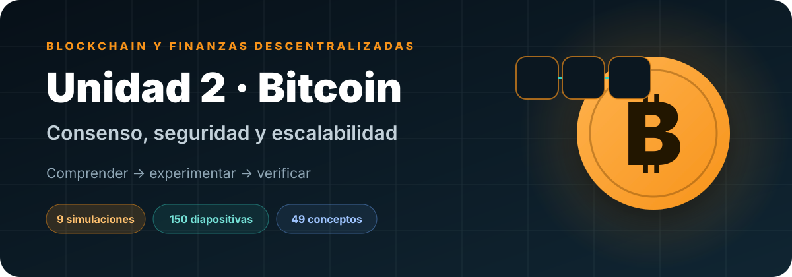
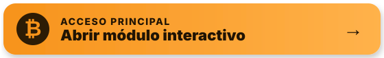

<p align="center">
  
</p>

<p align="center"><strong>Material elaborado por el profesor Sergio Gevatschnaider</strong></p>

<p align="center">
  <a href="https://sgevatschnaider.github.io/blockchain-finanzas-descentralizadas/unidades/u02-criptoactivos-consenso-seguridad/"></a>
  <a href="https://sgevatschnaider.github.io/blockchain-finanzas-descentralizadas/unidades/u02-criptoactivos-consenso-seguridad/simuladores/"></a>
</p>

<p align="center">
  <a href="https://sgevatschnaider.github.io/blockchain-finanzas-descentralizadas/unidades/u02-criptoactivos-consenso-seguridad/materiales/">Presentaciones</a> ·
  <a href="https://sgevatschnaider.github.io/blockchain-finanzas-descentralizadas/unidades/u02-criptoactivos-consenso-seguridad/recursos/glosario-bitcoin.html">Glosario</a> ·
  <a href="https://sgevatschnaider.github.io/blockchain-finanzas-descentralizadas/unidades/u02-criptoactivos-consenso-seguridad/evaluacion/cuestionario-bitcoin.html">Cuestionario</a> ·
  <a href="https://sgevatschnaider.github.io/blockchain-finanzas-descentralizadas/unidades/u02-criptoactivos-consenso-seguridad/planillas/laboratorio-bitcoin.xlsx">Planilla de laboratorio</a>
</p>

---

## Una unidad para comprender Bitcoin como sistema

Esta unidad conecta criptografía, transacciones, minería, consenso, seguridad económica, emisión y escalabilidad. La secuencia combina explicación conceptual, experimentación visual y evaluación con retroalimentación.

| Experiencia | Contenido |
|---|---|
| **9 laboratorios interactivos** | Parámetros editables, resultados visuales, modo automático y progreso local |
| **150 diapositivas** | Cuatro presentaciones en PDF interactivo y Google Slides |
| **49 conceptos** | Glosario desarrollado con relaciones y errores frecuentes |
| **20 preguntas** | Cuestionario formativo con explicación de cada respuesta |

## Ruta pedagógica

| Bloque | Pregunta central | Núcleo conceptual | Laboratorios |
|---|---|---|---|
| **1 · Propiedad y transacción** | ¿Qué se controla y cómo se transfiere? | Claves, direcciones, hashes, UTXO, inputs, outputs, cambio y fees | 01–04 |
| **2 · Consenso** | ¿Cómo acuerda la red un historial? | Mempool, bloque candidato, Merkle root, nonce, target, dificultad y PoW | 05–06 |
| **3 · Seguridad** | ¿Por qué es costoso reemplazar la historia? | Forks, chainwork, confirmaciones, reorganizaciones y ataque del 51 % | 07–08 |
| **4 · Economía y escala** | ¿Cómo evolucionan los incentivos y la capacidad? | Subsidio, halving, comisiones, canales, HTLC, liquidez y ruteo | 09 + presentaciones |

## Simulaciones independientes

Cada tarjeta abre la simulación publicada en GitHub Pages, no el archivo fuente de GitHub. Los laboratorios son HTML autónomos, incluyen cambio de tema, recorrido automático y guardado de progreso en el navegador.

| | | |
|---|---|---|
| **01 · [Claves y direcciones](https://sgevatschnaider.github.io/blockchain-finanzas-descentralizadas/unidades/u02-criptoactivos-consenso-seguridad/simuladores/01-claves-direcciones.html)**<br><sub>Entropía, clave privada, clave pública y dirección.</sub> | **02 · [SHA-256 y efecto avalancha](https://sgevatschnaider.github.io/blockchain-finanzas-descentralizadas/unidades/u02-criptoactivos-consenso-seguridad/simuladores/02-sha256-avalancha.html)**<br><sub>Difusión y sensibilidad de entrada.</sub> | **03 · [Modelo UTXO](https://sgevatschnaider.github.io/blockchain-finanzas-descentralizadas/unidades/u02-criptoactivos-consenso-seguridad/simuladores/03-modelo-utxo.html)**<br><sub>Inputs, outputs, cambio y conservación del valor.</sub> |
| **04 · [Bitcoin Transaction Lab](https://sgevatschnaider.github.io/blockchain-finanzas-descentralizadas/unidades/u02-criptoactivos-consenso-seguridad/simuladores/04-transaccion-bitcoin.html)**<br><sub>Firma, validación y propagación.</sub> | **05 · [Mempool, fees y minería PoW](https://sgevatschnaider.github.io/blockchain-finanzas-descentralizadas/unidades/u02-criptoactivos-consenso-seguridad/simuladores/05-mempool-fees-mineria.html)**<br><sub>Selección económica y búsqueda de nonce.</sub> | **06 · [Merkle Tree y Merkle Proof](https://sgevatschnaider.github.io/blockchain-finanzas-descentralizadas/unidades/u02-criptoactivos-consenso-seguridad/simuladores/06-merkle-tree-proof.html)**<br><sub>Raíz compacta y prueba de inclusión.</sub> |
| **07 · [Fork, chainwork y confirmaciones](https://sgevatschnaider.github.io/blockchain-finanzas-descentralizadas/unidades/u02-criptoactivos-consenso-seguridad/simuladores/07-fork-chainwork-confirmaciones.html)**<br><sub>Selección de cadena y finalidad probabilística.</sub> | **08 · [Ataque del 51 %](https://sgevatschnaider.github.io/blockchain-finanzas-descentralizadas/unidades/u02-criptoactivos-consenso-seguridad/simuladores/08-ataque-51.html)**<br><sub>Reorganización, doble gasto y límites.</sub> | **09 · [Lightning Network](https://sgevatschnaider.github.io/blockchain-finanzas-descentralizadas/unidades/u02-criptoactivos-consenso-seguridad/simuladores/09-lightning-network.html)**<br><sub>Canales, liquidez, HTLC y liquidación.</sub> |

<p align="center">
  <a href="https://sgevatschnaider.github.io/blockchain-finanzas-descentralizadas/unidades/u02-criptoactivos-consenso-seguridad/simuladores/"></a>
</p>

## Presentaciones y documentos

El [visor de clase](https://sgevatschnaider.github.io/blockchain-finanzas-descentralizadas/unidades/u02-criptoactivos-consenso-seguridad/materiales/) permite:

- elegir entre **PDF interactivo** y **Google Slides**;
- avanzar con botones laterales, flechas del teclado, barra deslizante o gestos táctiles;
- reproducir automáticamente con intervalos configurables;
- conservar controles y autoplay al entrar en pantalla completa;
- descargar la parte PDF que se está consultando.

Presentaciones incluidas:

1. Bitcoin desde el white paper — 36 diapositivas.
2. Proof of Work frente a Proof of Stake — 55 diapositivas.
3. Halving de Bitcoin — 21 diapositivas.
4. Layer 2 en Bitcoin y Ethereum — 38 diapositivas.

También se encuentran el white paper original de Satoshi Nakamoto y la secuencia docente que vincula presentaciones y simulaciones.

## Consolidación y evaluación

| Recurso | Uso recomendado |
|---|---|
| [Glosario desarrollado](https://sgevatschnaider.github.io/blockchain-finanzas-descentralizadas/unidades/u02-criptoactivos-consenso-seguridad/recursos/glosario-bitcoin.html) | Buscar conceptos por capa y revisar función, relaciones y errores frecuentes |
| [Cuestionario formativo](https://sgevatschnaider.github.io/blockchain-finanzas-descentralizadas/unidades/u02-criptoactivos-consenso-seguridad/evaluacion/cuestionario-bitcoin.html) | Comprobar comprensión con 20 preguntas y retroalimentación explicada |
| [Planilla de laboratorio](https://sgevatschnaider.github.io/blockchain-finanzas-descentralizadas/unidades/u02-criptoactivos-consenso-seguridad/planillas/laboratorio-bitcoin.xlsx) | Registrar experimentos PoW, analizar riesgo de reversión y seguir la ruta |

La planilla puede abrirse con Excel o importarse directamente en Google Sheets. También hay un [CSV para registrar experimentos](planillas/registro-experimentos-pow.csv).

<details>
<summary><strong>Estructura técnica del módulo</strong></summary>

```text
u02-criptoactivos-consenso-seguridad/
├── index.html
├── assets/
├── simuladores/
│   ├── index.html
│   └── 01...09.html
├── materiales/
│   ├── index.html
│   └── pdf/
├── recursos/glosario-bitcoin.html
├── evaluacion/cuestionario-bitcoin.html
├── planillas/
└── html/  (material previo conservado)
```

</details>

> **Criterio docente:** los recursos previos de ciberseguridad general permanecen en `html/` para conservar enlaces externos, pero no interrumpen la secuencia específica de Bitcoin. La composabilidad DeFi corresponde a una unidad posterior.

<p align="center"><a href="../../">← Volver al curso completo</a></p>
