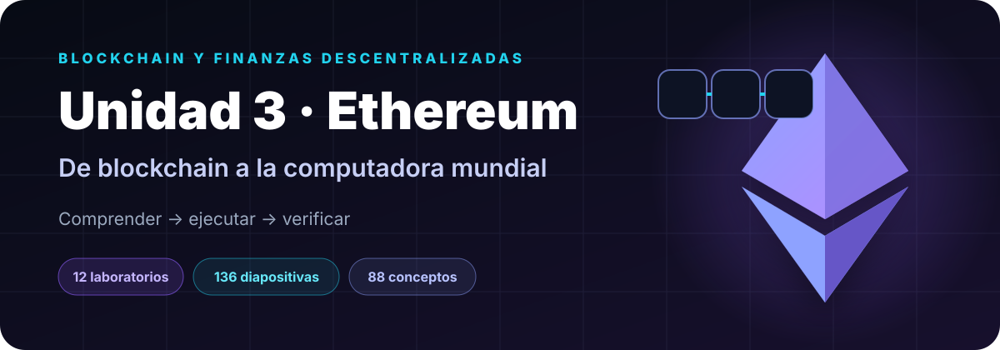

<p align="center">
  
</p>

<p align="center"><strong>Material elaborado por el profesor Sergio Gevatschnaider</strong></p>

<p align="center">
  <a href="https://sgevatschnaider.github.io/blockchain-finanzas-descentralizadas/unidades/u03-ethereum/"></a>
  <a href="https://sgevatschnaider.github.io/blockchain-finanzas-descentralizadas/unidades/u03-ethereum/simuladores/"></a>
</p>

<p align="center">
  <a href="https://sgevatschnaider.github.io/blockchain-finanzas-descentralizadas/unidades/u03-ethereum/materiales/">Presentaciones</a> ·
  <a href="https://sgevatschnaider.github.io/blockchain-finanzas-descentralizadas/unidades/u03-ethereum/simuladores/">Laboratorios</a> ·
  <a href="https://sgevatschnaider.github.io/blockchain-finanzas-descentralizadas/unidades/u03-ethereum/recursos/glosario.html">Glosario</a> ·
  <a href="https://sgevatschnaider.github.io/blockchain-finanzas-descentralizadas/unidades/u03-ethereum/evaluacion/cuestionario.html">Cuestionario</a>
</p>

---

## Una unidad para comprender Ethereum como sistema

Esta unidad conecta identidad criptográfica, cuentas, transacciones, EVM, gas, contratos inteligentes, Proof of Stake, tokens, escalabilidad, rollups, MEV y seguridad económica. Todos los accesos de esta página abren la experiencia publicada en GitHub Pages, no el archivo fuente del repositorio.

| Experiencia | Contenido |
|---|---|
| **12 laboratorios interactivos** | Parámetros editables, resultados visuales y progreso local |
| **136 diapositivas** | Seis presentaciones completas en PDF y PPTX editable |
| **88 conceptos** | Glosario interactivo con buscador, filtros, flashcards y mapa conceptual |
| **30 preguntas** | Evaluación formativa con respuestas desarrolladas |

## Ruta pedagógica

| Bloque | Pregunta central | Núcleo conceptual | Laboratorios |
|---|---|---|---|
| **1 · Identidad y transacción** | ¿Quién autoriza un cambio de estado? | Claves, direcciones, firma, nonce, mempool y recibos | 01–02 |
| **2 · Ejecución** | ¿Cómo ejecuta reglas la red? | Estado global, gas, EIP-1559, stack, memoria, storage y contratos | 03–06 |
| **3 · Consenso** | ¿Cómo converge y finaliza Ethereum? | Validadores, slots, attestations, fork choice, finality y slashing | 07–09 |
| **4 · Activos y escala** | ¿Cómo se programan activos y se amplía la capacidad? | ERC-20, ERC-721, rollups, calldata, blobs y disponibilidad de datos | 10–11 |
| **5 · Economía de bloques** | ¿Quién captura valor al ordenar transacciones? | MEV, searchers, builders, proposers y construcción de bloques | 12 |

## Laboratorios independientes

| | | |
|---|---|---|
| **01 · [Cuenta, clave y dirección](https://sgevatschnaider.github.io/blockchain-finanzas-descentralizadas/unidades/u03-ethereum/simuladores/01-cuenta-clave-direccion.html)**<br><sub>Clave privada, clave pública, dirección y firma.</sub> | **02 · [Anatomía de una transacción](https://sgevatschnaider.github.io/blockchain-finanzas-descentralizadas/unidades/u03-ethereum/simuladores/02-anatomia-transaccion.html)**<br><sub>Firma, hash, mempool e inclusión en bloque.</sub> | **03 · [EIP-1559 Gas Lab](https://sgevatschnaider.github.io/blockchain-finanzas-descentralizadas/unidades/u03-ethereum/simuladores/03-eip1559-gas-lab.html)**<br><sub>Base fee, priority fee, burn y costo final.</sub> |
| **04 · [Ethereum State Machine](https://sgevatschnaider.github.io/blockchain-finanzas-descentralizadas/unidades/u03-ethereum/simuladores/04-state-machine.html)**<br><sub>Cuentas, balances, nonce y cambios de estado.</sub> | **05 · [EVM Interactive Lab](https://sgevatschnaider.github.io/blockchain-finanzas-descentralizadas/unidades/u03-ethereum/simuladores/05-evm-interactive.html)**<br><sub>Program counter, opcodes, stack, memoria y storage.</sub> | **06 · [Smart Contract Lifecycle](https://sgevatschnaider.github.io/blockchain-finanzas-descentralizadas/unidades/u03-ethereum/simuladores/06-smart-contract-lifecycle.html)**<br><sub>Compilación, deploy, llamadas, eventos y receipt.</sub> |
| **07 · [Proof of Stake](https://sgevatschnaider.github.io/blockchain-finanzas-descentralizadas/unidades/u03-ethereum/simuladores/07-proof-of-stake.html)**<br><sub>Validadores, proposer, slots, attestations y epochs.</sub> | **08 · [Finality & Fork Choice](https://sgevatschnaider.github.io/blockchain-finanzas-descentralizadas/unidades/u03-ethereum/simuladores/08-finality-fork-choice.html)**<br><sub>LMD-GHOST, checkpoints y Casper FFG.</sub> | **09 · [Slashing & Validator Economics](https://sgevatschnaider.github.io/blockchain-finanzas-descentralizadas/unidades/u03-ethereum/simuladores/09-slashing-validator-economics.html)**<br><sub>Rewards, penalties, slashing e inactivity leak.</sub> |
| **10 · [ERC-20 / ERC-721 Token Lab](https://sgevatschnaider.github.io/blockchain-finanzas-descentralizadas/unidades/u03-ethereum/simuladores/10-erc20-erc721-token-lab.html)**<br><sub>Mint, transfer, approve, allowance y ownership.</sub> | **11 · [L1 vs L2 / Rollup Cost Lab](https://sgevatschnaider.github.io/blockchain-finanzas-descentralizadas/unidades/u03-ethereum/simuladores/11-l1-l2-rollup-cost-lab.html)**<br><sub>Batching, calldata, blobs y costo por transacción.</sub> | **12 · [MEV & Block Building](https://sgevatschnaider.github.io/blockchain-finanzas-descentralizadas/unidades/u03-ethereum/simuladores/12-mev-block-building.html)**<br><sub>Arbitraje, ordenamiento, searcher, builder y proposer.</sub> |

<p align="center">
  <a href="https://sgevatschnaider.github.io/blockchain-finanzas-descentralizadas/unidades/u03-ethereum/simuladores/"></a>
</p>

## Presentaciones y documentos

El [visor de clase](https://sgevatschnaider.github.io/blockchain-finanzas-descentralizadas/unidades/u03-ethereum/materiales/) permite elegir una presentación, avanzar por sus páginas, activar reproducción automática, entrar en pantalla completa y descargar las versiones PDF o PPTX.

1. Ethereum: de blockchain a la computadora mundial — 37 diapositivas.
2. Cuentas, transacciones, EVM y gas — 25 diapositivas.
3. Proof of Stake y consenso — 16 diapositivas.
4. Smart contracts, tokens y aplicaciones — 18 diapositivas.
5. Escalabilidad, L2, rollups, blobs y disponibilidad de datos — 20 diapositivas.
6. Economía, seguridad, MEV y roadmap — 20 diapositivas.

## Consolidación y evaluación

| Recurso | Uso recomendado |
|---|---|
| [Glosario interactivo](https://sgevatschnaider.github.io/blockchain-finanzas-descentralizadas/unidades/u03-ethereum/recursos/glosario.html) | Buscar y relacionar 88 conceptos mediante filtros, flashcards, quiz y mapa conceptual |
| [Cuestionario de 30 preguntas](https://sgevatschnaider.github.io/blockchain-finanzas-descentralizadas/unidades/u03-ethereum/evaluacion/cuestionario.html) | Comprobar comprensión con explicaciones desarrolladas y seguimiento de resultados |
| [Portal de la Unidad 3](https://sgevatschnaider.github.io/blockchain-finanzas-descentralizadas/unidades/u03-ethereum/) | Recorrer toda la unidad desde una interfaz única y conservar el progreso local |

<details>
<summary><strong>Estructura técnica del módulo</strong></summary>

```text
u03-ethereum/
├── index.html
├── assets/
├── simuladores/
│   ├── index.html
│   └── 01...12.html
├── materiales/
│   ├── index.html
│   ├── pdf/
│   └── pptx/
├── recursos/
│   └── glosario.html
└── evaluacion/
    └── cuestionario.html
```

</details>

<p align="center"><a href="https://sgevatschnaider.github.io/blockchain-finanzas-descentralizadas/">← Volver al curso completo</a></p>
