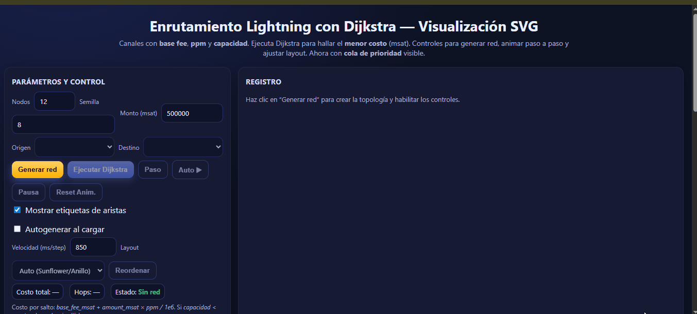

# U5 — Algoritmos y Criptografía para DeFi: Dijkstra en Lightning, ZKP y ZK-Rollups

> **ZKP · Versión mejorada del 29/09/2026**
>
> **[ABRIR LA CUEVA DE ALÍ BABÁ — NUEVA VERSIÓN](https://sgevatschnaider.github.io/blockchain-finanzas-descentralizadas/unidades/u05-algoritmos-criptografia-defi-dijkstra-lightning-zkp-zkrollups/recursos/ZPK_Simulador_hash.html?v=20260929-2)**
>
> [Abrir el campus actualizado de la unidad 5](https://sgevatschnaider.github.io/blockchain-finanzas-descentralizadas/unidades/u05-algoritmos-criptografia-defi-dijkstra-lightning-zkp-zkrollups/?v=20260929-2) · [Leer la teoría ZKP](https://sgevatschnaider.github.io/blockchain-finanzas-descentralizadas/unidades/u05-algoritmos-criptografia-defi-dijkstra-lightning-zkp-zkrollups/recursos/ZPK_TEORIA.html?v=20260929-2)
>
> La versión nueva tiene tres pestañas: **Cueva de Alí Babá**, **Compromiso hash** y **Guía de estudio**. Para usarla, abrí el enlace anterior; la vista de archivos HTML en GitHub muestra su código.

[](#)
[](#)
[](#)

> **Vista previa** · Enrutamiento Lightning (Dijkstra) — simulación y registro paso a paso 

**Carpeta de la unidad (GitHub):**
`/unidades/u05-algoritmos-criptografia-defi-dijkstra-lightning-zkp-zkrollups/`

---

## 🎯 Objetivos de aprendizaje

*   **Modelar** Lightning Network como **grafo ponderado con restricciones de capacidad** (canales/HTLCs) y entender su **estructura de comisiones**.
*   **Aplicar Dijkstra** para ruteo de pagos minimizando costo total: `base_fee_msat + amount_msat * ppm / 1e6`.
*   **Comprender** fundamentos de **Zero-Knowledge Proofs (ZKP)**: *completeness, soundness, zero-knowledge*; compromisos y *hash preimage*.
*   **Analizar** la arquitectura de **ZK-Rollups**: secuenciamiento, lotes, pruebas de validez, publicación de *state roots* y riesgos de *data availability*.
*   **Conectar** con **TradFi vs DeFi**, **AMMs**, **MEV** y consideraciones **regulatorias** que afectan ejecución, costos y seguridad.

## 🗺️ Recursos de la unidad (HTML interactivos)

### Módulo 1: Lightning Network

| Recurso Educativo | Enlace Directo |
| :--- | :--- |
| **Guía Teórica: Lightning Network** <br><br><details><summary><strong>Resumen:</strong> <em>(clic para expandir)</em></summary><p>Una guía de estudio completa sobre la arquitectura de Lightning Network como solución de Capa 2. Explora desde conceptos básicos como canales de pago y HTLCs hasta su representación como un grafo ponderado. Incluye un ejemplo detallado del algoritmo de Dijkstra para el enrutamiento y analiza sus principales casos de uso, como micropagos y aplicaciones en el metaverso.</p></details> | [](https://sgevatschnaider.github.io/blockchain-finanzas-descentralizadas/unidades/u05-algoritmos-criptografia-defi-dijkstra-lightning-zkp-zkrollups/recursos/Ligthling_Teoría.html) |
| **Visualización de Dijkstra (Simple)** <br><br><details><summary><strong>Resumen:</strong> <em>(clic para expandir)</em></summary><p>Una visualización interactiva en SVG que simula el algoritmo de Dijkstra para encontrar la ruta de menor costo en una red Lightning. Permite generar una topología de red, establecer un origen/destino, y animar el proceso paso a paso para observar cómo el algoritmo explora los nodos y relaja las aristas hasta encontrar el camino óptimo.</p></details> | [](https://sgevatschnaider.github.io/blockchain-finanzas-descentralizadas/unidades/u05-algoritmos-criptografia-defi-dijkstra-lightning-zkp-zkrollups/recursos/lightning.Dijstra.html) |
| **Visualización de Dijkstra (Completa)** <br><br><details><summary><strong>Resumen:</strong> <em>(clic para expandir)</em></summary><p>Una versión avanzada del simulador de Dijkstra que incluye un panel de "inspección" detallado. Además de la visualización del grafo, muestra en tiempo real el estado de la <strong>cola de prioridad</strong>, el conjunto de nodos visitados y las tablas de distancias (`dist[v]`) y predecesores (`prev[v]`). Es una herramienta pedagógica ideal para un análisis profundo del algoritmo.</p></details> | [](https://sgevatschnaider.github.io/blockchain-finanzas-descentralizadas/unidades/u05-algoritmos-criptografia-defi-dijkstra-lightning-zkp-zkrollups/recursos/Lighting_Dijistra_completo.html) |
| **Guía: Arquitectura Criptográfica** <br><br><details><summary><strong>Resumen:</strong> <em>(clic para expandir)</em></summary><p>Una guía fundamental sobre los pilares tecnológicos de la Lightning Network. Detalla cómo la red aprovecha las primitivas criptográficas de Bitcoin, como las firmas digitales, las funciones hash y los bloqueos de tiempo. Explica la estructura de los canales multifirma, el rol central de los HTLCs y los mecanismos de seguridad avanzados como las transacciones de penalización y los <em>Watchtowers</em>.</p></details> | [](https://sgevatschnaider.github.io/blockchain-finanzas-descentralizadas/unidades/u05-algoritmos-criptografia-defi-dijkstra-lightning-zkp-zkrollups/recursos/Ligthling-La%20Arquitectura%20Criptogr%C3%A1fica%20de%20la%20Lightning%20Network.html) |
| **Guía: Anatomía de un Pago** <br><br><details><summary><strong>Resumen:</strong> <em>(clic para expandir)</em></summary><p>Ofrece una descripción detallada del ciclo de vida de un pago en la red. Desglosa el proceso en fases claras: la generación del secreto (preimagen) y su hash, la construcción de una cadena de HTLCs con <em>timelocks</em> decrecientes, y la liquidación atómica en cascada que garantiza la seguridad de los fondos. También cubre cómo se manejan los intentos de fraude y la desconexión de nodos.</p></details> | [](https://sgevatschnaider.github.io/blockchain-finanzas-descentralizadas/unidades/u05-algoritmos-criptografia-defi-dijkstra-lightning-zkp-zkrollups/recursos/Ligthling_Anatom%C3%ADa%20de%20un%20Pago%20en%20la%20Lightning%20Network.html) |

---

### Módulo 2: Pruebas de Conocimiento Cero (ZKP) y ZK-Rollups

| Recurso Educativo | Enlace Directo |
| :--- | :--- |
| **Guía Teórica: Pruebas de Conocimiento Cero (ZKP)** <br><br><details><summary><strong>Resumen:</strong> <em>(clic para expandir)</em></summary><p>Una introducción a las pruebas de conocimiento cero y a la privacidad verificable. El material explica las propiedades fundamentales (completitud, solidez, cero conocimiento), compara los tipos de ZKP más importantes (SNARKs vs. STARKs), y explora sus casos de uso en producción, con un enfoque en el escalado de blockchain, videojuegos y el metaverso.</p></details> | [](https://sgevatschnaider.github.io/blockchain-finanzas-descentralizadas/unidades/u05-algoritmos-criptografia-defi-dijkstra-lightning-zkp-zkrollups/recursos/ZPK_TEORIA.html) |
| **Guía Teórica: ZK-Rollups** <br><br><details><summary><strong>Resumen:</strong> <em>(clic para expandir)</em></summary><p>Guía enfocada en la arquitectura de los ZK-Rollups como la principal solución de escalado para blockchains. Desglosa el ciclo de vida de un lote, los componentes clave de la infraestructura (Secuenciador, Prover, Verificador) y los fundamentos de su seguridad, incluyendo el concepto de Disponibilidad de Datos (DA) que diferencia a un ZK-Rollup de un Validium.</p></details> | [](https://sgevatschnaider.github.io/blockchain-finanzas-descentralizadas/unidades/u05-algoritmos-criptografia-defi-dijkstra-lightning-zkp-zkrollups/recursos/ZPK_Rollups.html) |
| **Glosario de Términos ZKP** <br><br><details><summary><strong>Resumen:</strong> <em>(clic para expandir)</em></summary><p>Un glosario exhaustivo que define los términos y conceptos clave del ecosistema ZKP. Organizado en secciones temáticas, cubre desde los fundamentos y primitivas criptográficas hasta los componentes de un ZK-Rollup, su flujo operativo, métricas de rendimiento y el stack de herramientas para desarrolladores, convirtiéndolo en una referencia rápida y esencial.</p></details> | [](https://sgevatschnaider.github.io/blockchain-finanzas-descentralizadas/unidades/u05-algoritmos-criptografia-defi-dijkstra-lightning-zkp-zkrollups/recursos/ZPK_Glosario.html) |
| **Simulador ZKP: Cueva de Alí Babá + Compromiso Hash** <br><br><details><summary><strong>Resumen:</strong> <em>(clic para expandir)</em></summary><p>Un laboratorio con tres secciones: cueva de Alí Babá, compromiso hash y guía de estudio. La cueva permite avanzar paso a paso, comparar la vista docente con la del verificador y experimentar con la probabilidad de engaño. El compromiso usa SHA-256 real y muestra por qué verificar una apertura no equivale a una ZKP.</p></details> | [](https://sgevatschnaider.github.io/blockchain-finanzas-descentralizadas/unidades/u05-algoritmos-criptografia-defi-dijkstra-lightning-zkp-zkrollups/recursos/ZPK_Simulador_hash.html) |
| **Simulador Interactivo de ZK-Rollups** <br><br><details><summary><strong>Resumen:</strong> <em>(clic para expandir)</em></summary><p>Una simulación visual que modela la dinámica de un ZK-Rollup. Los usuarios pueden ajustar parámetros como el tamaño del lote, la tasa de llegada de transacciones y los costos de gas para observar en tiempo real su impacto en métricas clave como el TPS efectivo, el costo por transacción y la finalidad del lote. Permite comparar el modo ZK-Rollup (DA on-chain) vs. Validium (DA off-chain).</p></details> | [](https://sgevatschnaider.github.io/blockchain-finanzas-descentralizadas/unidades/u05-algoritmos-criptografia-defi-dijkstra-lightning-zkp-zkrollups/recursos/ZPK_ROLLUP_SIMULADOR.HTML) |
| **Animación: Flujo de un ZK-Rollup** <br><br> | [](https://raw.githubusercontent.com/sgevatschnaider/blockchain-finanzas-descentralizadas/main/unidades/u05-algoritmos-criptografia-defi-dijkstra-lightning-zkp-zkrollups/recursos/simulacion.gif) |

---

## 📚 Marco conceptual (TL;DR académico)

### 1) TradFi ↔ DeFi: plataformas y microestructura

*   **TradFi**: *order books* centralizados, *clearing*, custodia, KYC/AML.
*   **DeFi**: contratos, **AMMs** (x·y=k y variantes), *permissionless* y composables.
*   **Ejecución**: costos (fees), **finality**, latencia y calidad de liquidez afectan *slippage* y riesgo operacional.

### 2) AMMs y MEV

*   **AMMs** fijan precio por función; el **slippage** depende de profundidad.
*   **MEV** redistribuye valor por ordenamiento de transacciones; **PBS** y L2 cambian incentivos.
*   Implicancias para estrategias, *front-running* y *commit-reveal*.

### 3) Lightning como grafo de costos

*   Aristas = canales con **capacidad direccional**; pesos: `base_fee_msat` y `ppm`.
*   **Restricción**: sólo se consideran aristas con capacidad ≥ monto (poda).
*   **Objetivo**: camino de **menor costo** sujeto a factibilidad ⇒ Dijkstra con **cola de prioridad**.

### 4) ZKP y ZK-Rollups

*   **ZKP**: verificar sin revelar el testigo (privacidad/verificabilidad).
*   **ZK-Rollups**: ejecución off-chain + prueba de validez + datos suficientes publicados en L1 para reconstruir el estado. La privacidad de las transacciones requiere un diseño adicional.
*   **Trade-offs**: *data availability*, latencia de retiro, centralización del *sequencer*.

### 5) Regulación (alto nivel)

*   Enfoque **risk-based**: custodia, *travel rule*, auditoría criptográfica, *on/off-ramps*.
*   Puntos de atención en **Lightning** y **Rollups**: operadores, puentes, y cumplimiento transfronterizo.

---

## 🔍 ¿Qué hace cada simulador?

### A) **Lightning + Dijkstra**

*   **Genera** topologías (nodos/aristas) y permite setear **base fee**, **ppm**, **capacidad** y **monto (msat)**.
*   **Ejecuta** Dijkstra:

    1.  inicializa cola de prioridad; 2) relaja aristas válidas por capacidad;
    2.  actualiza costo acumulado y predecesores; 4) reconstruye ruta mínima.
*   **Muestra**: *logs* paso a paso, **costo total**, **hops** y etiquetas en SVG.

### B) **ZKP — Cueva de Alí Babá y compromisos**

*   La cueva ejecuta **entrada oculta → desafío aleatorio → respuesta → verificación**, con una puerta interior que conecta A y B.
*   La **vista del verificador** oculta la entrada y el cruce; la **vista docente** los muestra para explicar el mecanismo.
*   Sin secreto, la probabilidad de pasar **todas las k rondas independientes de una sesión fijada de antemano** es `2^-k`. No es la probabilidad posterior de que una persona mienta.
*   Compara **1000 sesiones** con y sin secreto, y distingue valores esperados de resultados empíricos.
*   El compromiso usa `C = SHA-256(r + ":" + mensaje)` con aleatoriedad privada r. Al abrirlo se entregan mensaje y r; **commit-reveal no es una ZKP**.
*   Una ZKP de preimagen requeriría demostrar que existe un testigo que satisface la relación del hash, enviando una prueba sin entregar el testigo. Este HTML no implementa ese sistema criptográfico.

### C) **ZK-Rollups**

*   **Secuenciamiento** → **loteo** → **prueba** → **verificación** → actualización de **state root**.
*   Modela costos y tiempos de loteo, generación y verificación. No genera pruebas criptográficas ni valida transacciones reales.

---

## 🧰 Guía de uso rápido

1.  Abre **`recursos/Lighting_Dijistra_completo.html`** → “Generar red” → define **origen/destino** y **monto** → **“Ejecutar Dijkstra”**.
2.  Abre **`recursos/ZPK_Simulador_hash.html`** → **Siguiente paso** o **Jugar 1 ronda** → compara los modos con/sin secreto → revisa **Compromiso hash** y **Guía de estudio**.
3.  Abre **`recursos/ZPK_ROLLUP_SIMULADOR.HTML`** → ajusta tamaño de lote y tasa de llegada → **Iniciar/Continuar** → compara **ZK-rollup** y **Validium**.

---

## 🧪 Laboratorios guiados

**Lab 1 — Rutas y capacidad (Lightning)**

*   Para 10 instancias aleatorias, busca ruta para `monto = 500k msat`.
*   Registra: `instancia, monto, costo_total_msat, hops, factible(S/N)` y explica **cuellos de botella**.

**Lab 2 — Sensibilidad a comisiones**

*   En una red fija, subí el `ppm` de un hub.
*   Medí cambio en **costo** y **ruta** óptima. Discute *pricing power*.

**Lab 3 — Cueva, compromiso y ZKP**

*   Ejecuta cinco rondas con el secreto activado: deben aceptarse todas. Desactívalo y observa aciertos y fallos.
*   Explica por qué el desafío debe generarse después de la entrada y qué observa realmente el verificador.
*   Compara `k = 1, 5, 10, 20` en 1000 sesiones. Calcula el número esperado de falsas aceptaciones `1000 × 2^-k`.
*   Crea tres compromisos con mensajes ficticios. Publica C, conserva r privada y revela mensaje + r al abrir.
*   Cambia el mensaje de apertura y observa el rechazo. Explica por qué una apertura correcta no prueba conocimiento cero.

**Lab 4 — Data Availability (ZK-Rollups)**

*   Compara el costo del modelo con DA en L1 y fuera de L1. El simulador no permite inyectar lotes inválidos ni ejecuta un verificador criptográfico real.
*   Debate: efectos de falla de disponibilidad de datos en **retiros** y confianza.

---

## 🧷 Rúbrica de evaluación (100 pts)

| Criterio | Descripción | Pts |
| :--- | :--- | --: |
| Modelado Lightning | Ruteo correcto, análisis de capacidad/costos | 25 |
| Experimentos & Métricas | Tablas/gráficas, repetibilidad, interpretación | 20 |
| ZKP/Hash | Comprensión de compromiso/verificación y límites | 15 |
| ZK-Rollups | Flujo batch-prueba-verificación y análisis de fallas | 15 |
| Integración TradFi/DeFi | AMMs, MEV, regulación conectados a ejecución | 15 |
| Documentación | Informe claro + capturas/enlaces a simuladores | 10 |

---

## 🧱 Estructura del directorio

```bash
u05-algoritmos-criptografia-defi-dijkstra-lightning-zkp-zkrollups/
├── README.md
├── index.html
└── recursos/
    ├── Lighting_Dijistra_completo.html
    ├── lightning.Dijstra.html
    ├── Ligthling_Teoría.html
    ├── ZPK_TEORIA.html
    ├── ZPK_Glosario.html
    ├── ZPK_Rollups.html
    ├── ZPK_ROLLUP_SIMULADOR.HTML
    ├── ZPK_Simulador_hash.html
    ├── ZPK_ Simulador_hash.html  # redirección compatible
    └── simulacion.gif
```

---

## 🛠️ Apéndice técnico

**Dijkstra (Lightning):**

*   Peso de arista: `w(u,v) = base_fee_msat + amount_msat * ppm / 1e6`.
*   Poda por **capacidad direccional**: si `cap(u,v) < amount_msat`, descartar.
*   Implementación típica: **cola de prioridad** (min-heap) sobre costo acumulado.
*   Extensiones: penalización por **confiabilidad**, **multi-criterio** (costo-vs-hops/latencia), *retries* probabilísticos.

**ZKP (esqueleto formal):**

*   *Completeness* (acepta si verdad), *Soundness* (difícil engañar), *Zero-Knowledge* (no filtra info del testigo).
*   Familias: protocolos Σ, zk-SNARKs (el setup depende del esquema y sus compromisos polinomiales), zk-STARKs (transparentes; tamaño y rendimiento dependen de los parámetros).

**ZK-Rollups:**

*   Pipeline: usuario → **sequencer** → *batch* → **validity proof** → **verificador L1** → actualización de estado.
*   Riesgos: *data availability*, censura del sequencer, tiempos de retiro.

---

## 🔁 Conexión curricular

*   **Desde U3/U4**: plataformas DeFi, costos y latencia → aquí bajamos a **algoritmos** y **pruebas**.
*   **Hacia U6**: *trading* y gestión de riesgo; lo aprendido (costos, latencia, MEV) se traduce en **slippage**, *fills* y riesgo operativo.

---

## 🧩 Checklist rápido

*   [ ] Obtengo rutas válidas para `monto=500k msat` en ≥80% de instancias.
*   [ ] Entiendo cómo `ppm` y `base_fee` cambian el **costo marginal**.
*   [ ] Distingo hash, compromiso, apertura y ZKP; sé que verificar una apertura requiere recibir el valor y la aleatoriedad.
*   [ ] Describo el flujo de una tx en **ZK-Rollup**, los datos publicados en L1 y la diferencia entre validez, privacidad, disponibilidad y finalidad.
*   [ ] Relaciono **AMMs/MEV/regulación** con ejecución y diseño de incentivos.

---

## 🤝 Contribuciones & buenas prácticas

*   PRs/Issues: enlaces relativos, sin secretos/llaves, respeto de licencias.
*   Nombres de archivo: evitá renombrar; si lo hacés, actualizá todos los enlaces.
*   Para clases: abrir en **pantalla completa**; si el SVG se ve vacío, **“Generar red”** → **“Ejecutar Dijkstra”**.

---


## Ruta recomendada para estudiar ZKP

1. [Cueva de Alí Babá · laboratorio interactivo](https://sgevatschnaider.github.io/blockchain-finanzas-descentralizadas/unidades/u05-algoritmos-criptografia-defi-dijkstra-lightning-zkp-zkrollups/recursos/ZPK_Simulador_hash.html).
2. [Teoría: afirmación, testigo y propiedades](https://sgevatschnaider.github.io/blockchain-finanzas-descentralizadas/unidades/u05-algoritmos-criptografia-defi-dijkstra-lightning-zkp-zkrollups/recursos/ZPK_TEORIA.html).
3. [Glosario](https://sgevatschnaider.github.io/blockchain-finanzas-descentralizadas/unidades/u05-algoritmos-criptografia-defi-dijkstra-lightning-zkp-zkrollups/recursos/ZPK_Glosario.html) y [arquitectura de rollups](https://sgevatschnaider.github.io/blockchain-finanzas-descentralizadas/unidades/u05-algoritmos-criptografia-defi-dijkstra-lightning-zkp-zkrollups/recursos/ZPK_Rollups.html).

La sigla estándar es **ZKP**. Se conservan los nombres históricos `ZPK_…` para no romper enlaces. El simulador tiene una ruta principal sin espacios; el archivo anterior con espacio redirige a ella.
